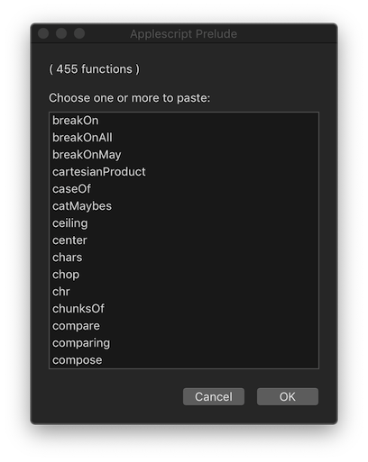

# prelude-applescript
Generic functions for macOS scripting with Applescript – function names as in [Hoogle](https://www.haskell.org/hoogle/?hoogle=concatMap).

In Applescript it may be simpler to paste functions from this library
into your scripts, and use them directly, rather than referencing a
global 'include' of the whole library.

Nevertheless, for initial drafting and testing, it is certainly possible
to make the whole library (over 350 functions) available to a script:

## Example

Here is a script which shows a menu of all the functions
in the library, inviting the user to choose one or more for pasting.

(The source code of all selected functions is then copied to the clipboard):



```applescript
use AppleScript version "2.4"
use framework "Foundation"
use scripting additions

--     Rob Trew (c) 2018 MIT

--     macOS menu for choosing a set of Applescript Prelude functions to paste.

property _ : missing value

--  EDIT THESE FILEPATHS TO MATCH YOUR SYSTEM:

-- Library files at: https://github.com/RobTrew/prelude-applescript
property jsonPath : "~/prelude-applescript/asPreludeDict.json"
property asPreludeLibPath : "~/prelude-applescript/asPrelude.applescript"

on run
    if _ is missing value then set _ to prelude(asPreludeLibPath)

    script functionMenu
        on |λ|(recFns)
            tell _ to set ks to sort(keys(recFns))
            tell application "System Events"
                activate
                set choice to choose from list ks ¬
                    with title "Applescript Prelude" with prompt "( " & ¬
                    (length of ks) & " functions )" & ¬
                    linefeed & linefeed & ¬
                    "Choose one or more to paste:" default items {item 1 of ks} ¬
                    with multiple selections allowed

                if choice is not false then
                    script sourceCode
                        on |λ|(k)
                            set mbSource to _'s lookupDict(k, recFns)
                            if Nothing of mbSource then
                                {}
                            else
                                {Just of mbSource}
                            end if
                        end |λ|
                    end script
                    tell _ to set strFns to intercalate(linefeed & linefeed, ¬
                        concatMap(sourceCode, choice))

                    -- VALUE RETURNED
                    set the clipboard to strFns
                    strFns
                else
                    ""
                end if
            end tell
        end |λ|
    end script

    tell _
        if doesFileExist(jsonPath) then
            set lrJSON to readFileLR(jsonPath)
        else
            set lrJSON to |Left|("File not found: " & jsonPath)
        end if

        bindLR(bindLR(lrJSON, _'s jsonParseLR), functionMenu)
    end tell
end run

-- prelude :: FilePath -> Script
on prelude(filePath)
    -- (path to a library file returns a 'me' value)

    set ca to current application
    set {bln, int} to (ca's NSFileManager's defaultManager's ¬
        fileExistsAtPath:((ca's NSString's stringWithString:filePath)'s ¬
            stringByStandardizingPath) isDirectory:(reference))

    if (bln and (int ≠ 1)) then
        set strPath to filePath
        run script (((ca's NSString's ¬
            stringWithString:strPath)'s ¬
            stringByStandardizingPath) as string)
    end if
end prelude
```
